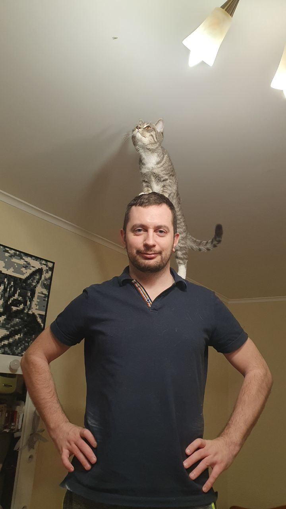

# Wake up Neo ...

_Хоть меня зовут не Нео, а Павел, но именно после просмотра фильма Матрица у меня появилась мечта стать программистом.
Для ее воплощения потребовались десятилетия проб и ошибок в других, совсем не связанных с программированием направлений, чтобы в конце концов осознать, что вот оно,_ **то самое**, _о чем я мечтал с детства!_

_Это чувство вернулось в тот момент, когда я по совету друзей зашел на сайт Нетологии, чтобы записаться на курс Проджект менеджера.
Но вот я сижу и с улыбкой на лице делаю дз по курсу_ **Fullstack-разработчик на Python**)))

###### А на фото моя любовь - Василиса =)
